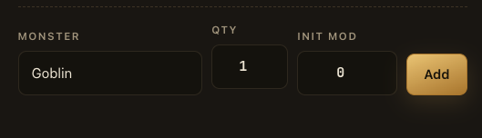

# Fix: misaligned vertical alignment of monster add inputs

## Summary

In the "Add monster" row on the encounter setup screen, the **Add** button
does not line up with the Monster / Qty / Init Mod inputs above it.

## Current behavior

- `web/src/features/encounters/EncounterSetupPage.tsx` (~lines 88-150)
  lays the row out with `flex flex-wrap items-end gap-2.5`.
- The Monster/Qty/Init Mod fields are each wrapped in `Field`
  (`web/src/components/Field.tsx`), which stacks a label + the input
  (label height + `gap-[7px]` + input).
- The **Add** `Button` is a bare sibling with no label above it, so under
  `items-end` its bottom edge matches the fields' bottom edge, but it has
  no equivalent top offset — it reads as vertically misplaced relative to
  the label row.
- There's also a ~2px height mismatch between the button's padding
  (`size="md"` → `py-[11px]` in `Button.tsx`) and the input's padding in
  `Field.tsx`, compounding the visual misalignment.

## Proposed fix

Either:

- Add an invisible label-height spacer above the button so it participates
  in the same label+gap+control structure as the `Field`s
  (e.g. `
Add<Button/>
`), or
- Switch the row to a grid layout with an explicit row height instead of
  `items-end` flex, so all controls (labeled and unlabeled) align on the
  same baseline regardless of label presence.

Also reconcile the button and input padding so their rendered heights
match exactly.

## Acceptance criteria

- [ ] Add button's input area is vertically aligned with Monster/Qty/Init
      Mod inputs, matching the intended design.
- [ ] Fix holds at different viewport widths (row wraps on narrow screens
      without reintroducing misalignment).
